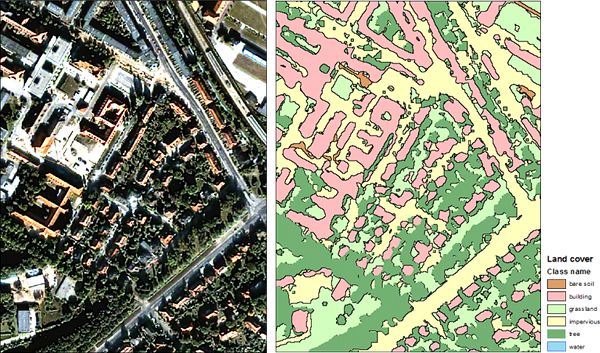
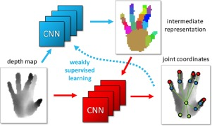
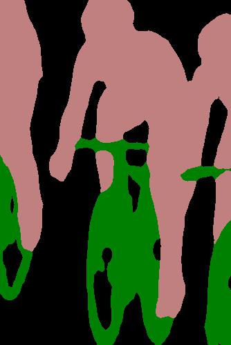

# Capstone Project Proposal: Pixel-level Object Dectection 

## Motivations: Bussiness Value 
### 1. Oil and Gas E&P : Automatic Seismic [Fault](https://en.wikipedia.org/wiki/Fault_(geology))/[Horizon](http://subsurfwiki.org/wiki/Horizon) picking and interpretation 
 

Where to drill and when to drill is one of the most important items on stake holder worry plate in oil and gas E&P.  A well interpreted seismic image is an important tool on the table to help answer those questions. Interpreting a seismic image requires that the interpreter manually check the seismic image and draw upon his or her geological understanding to pick the most likely interpretation from the many “valid” interpretations that the data allow. 

Interpreting faults in seismic image is difficult and tedious, especially in complex, highly faulted formations. Faults can be difficult to pick if they are steeply dipping, or if they are aligned such that they are not easily visible on Inlines or Crosslines. Inaccurate and incomplete interpretations often lead to missed pay, inefficient field development, miscorrelations, drilling hazards – and ultimately dry holes.There are many [state-of-art solutions](https://www.cgg.com/en/What-We-Do/GeoSoftware/Advanced-Seismic-Interpretation/Automated-Fault-Extraction) to speed up the process, these solutions fall in the region of feature engineering and hard to generalize. The current best solution is still on hand-picking or semi-hand-picking by human experts. 

Semantic segmentation is potentially a good AI solution to Falut/Horizon picking and iterpretation as they share many common challenges: 1. Pixel level accuracy: the effective pixel size in a subsurface seismic image could be ~ 25 m x 25 m and a borehole could be ~ 20-30 inches, and the pixel level accuracy makes a big difference when deciding where to drill a well. 2. Pixel level classification: in semantic segmentation, we identify each pixel as car, pedestrain and in seismic fault/horizon interpretation, we identify pixel as layers between Petrel and Oligocence or in a Fault block...) 3. High-stake: I can't elaborate more of how high the stakes are. 

The challenges ahead: 1. Data sets: most of the interpreted data sets are proprietary assets of big oil companies, and those data sets are not regularized for Deep learning training purose.  2. Algorithms: Current best practice for segmantic segmentation. 

This capstone project can be served as an assessment on the state-of-art algorithms publically available. 

### 2. Other applications : Infering knowledge from imagery
Self Driving Car     |  Identify object from satellite imagery |  Human Machine Interaction         
:---------------:|:--------------:|:--------------:
||

## Semantic Segmentation: State of Art

Semantic segmentation is the frontier of computer image recognition, which understand an image at pixel level. In segmantic segmentation, we will need to achieve three tasks: 1. recognize the objects; 2. delineate the boundary of each object; 3. Assign each pixel in the image an object class.

Raw Input            |  Predicted probability     |     Segmentation
:---------------:|:--------------:|:---------------:
||

In this project, I choose [ADE20K Dataset](http://groups.csail.mit.edu/vision/datasets/ADE20K/), which is used as a benchmark for [MIT Scene Parsing competetion (2017)](http://sceneparsing.csail.mit.edu/). The ADE20k data set contains more than 20K scene-centric images exhaustively annotated with objects and object parts. Specifically, the benchmark is divided into 20K images for training, 2K images for validation, and another batch of held-out images for testing. MIT provides [a benchmark model](https://github.com/hangzhaomit/semantic-segmentation-pytorch/tree/e21b8e2bfb1cb145941c36468fc807f20146b71a) for their competition, which I will use as my benchmark model. 

## Timeline and To do-list
### Define problem 
Given an image, we train a Deep Learning model to identify the object in the image on pixel level. The training data sets are ADE20K. 

### Metrics 
To assess performance, we use two metrics (1) mean of pixel wise accuracy.  (2) Mean of the standard Jaccard Index, commonly known as the PASCAL VOC intersection-over-union metric IoU=TP/TP+FP+FN, where TP, FP, and FN are the numbers of true positive, false positive, and false negative pixels, respectively, determined over the whole test set.

### Literature study and model selection
-[review](##reference)

### EDA 
[(Data QC Randomly selected 40 pic and target and put them togglable in PPT)](https://github.com/HoustonJ2013/Capstone_CV_Galvanize/blob/master/ppts/QC_Dec_12.pptx)

### Define pro-processing 
Seismic images only have one value in a pixel, compared to the RGB in the training data sets. In this project, I convert the RGB colored images to grayscale images in order for the model to be better generalized. The draw back is we loose some information in the original image, but we are still able to identify the objects from the images. 

I will use the benchmark model to justify the change of the scale, and how much it impacts on the performance. 

Conversion method TBD. Put a converted image here. 

### Potential challenges
This grayscale conversion may lead to modification of the model code and re-train the model, which could be expensive and time consuming. The performance may change due to the gray scale conversion. A good practice though. 

### Train models and analysis

### Conclusion and demo

## Data Sets to be used
+ [ADE20K Dataset](http://groups.csail.mit.edu/vision/datasets/ADE20K/)
+ [COCO 2017 Stuff Segmentation Challenge](http://cocodataset.org/#stuff-challenge2017) (Supplementary)

## Reference
+ [The Cityscapes Dataset for Semantic Urban Scene Understanding](https://arxiv.org/pdf/1604.01685.pdf)
+ [Hands Deep in Deep Learning for Hand Pose Estimation](https://arxiv.org/pdf/1502.06807.pdf)
+ [A 2017 Guide to Semantic Segmentation with Deep Learning](http://blog.qure.ai/notes/semantic-segmentation-deep-learning-review)
+ [Scene Parsing through ADE20K Dataset. Bolei Zhou, Hang Zhao, Xavier Puig, Sanja Fidler, Adela Barriuso and Antonio Torralba. Computer Vision and Pattern Recognition (CVPR), 2017.](http://people.csail.mit.edu/bzhou/publication/scene-parse-camera-ready.pdf)
+ [Semantic Understanding of Scenes through ADE20K Dataset. Bolei Zhou, Hang Zhao, Xavier Puig, Sanja Fidler, Adela Barriuso and Antonio Torralba. arXiv:1608.05442.](https://arxiv.org/pdf/1608.05442.pdf)
