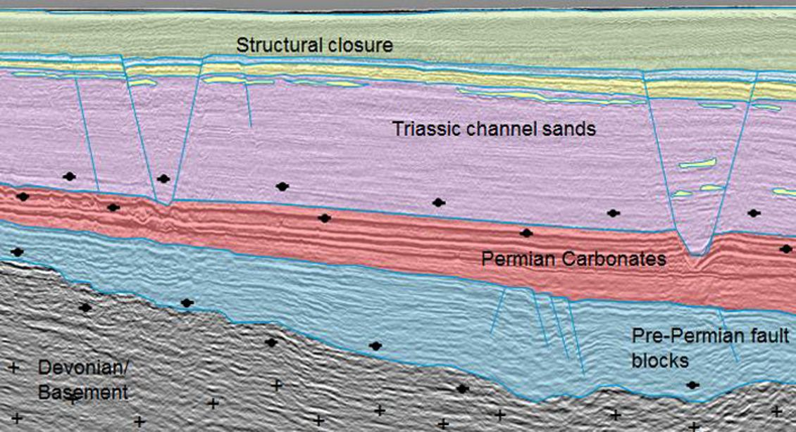
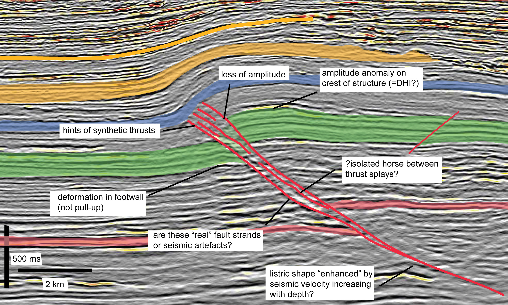
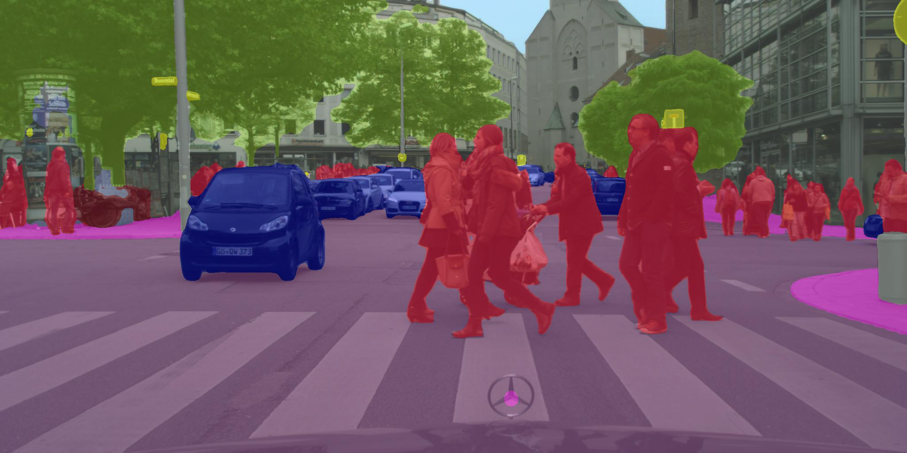
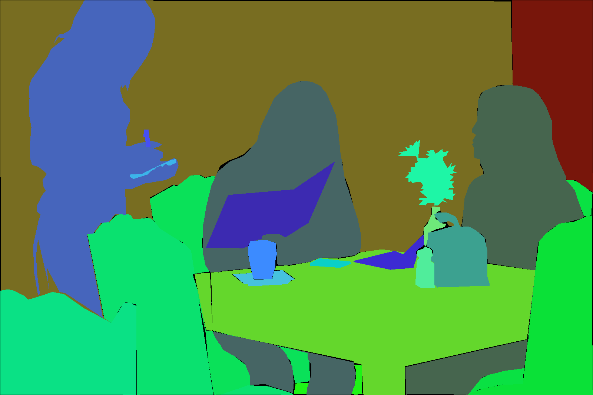
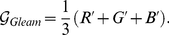
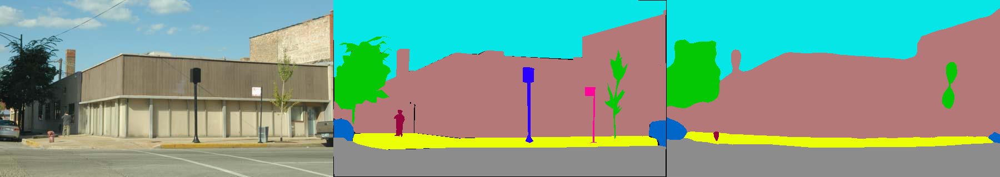
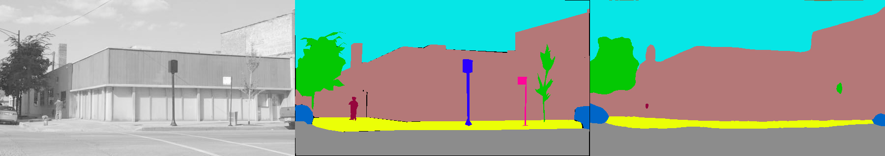

# Deep Learning Pixel-level Object Dectection: One Step Toward Automatic Seismic Interpretation:  

## Motivations: Bussiness Value 
### 1. Oil and Gas E&P : Automatic Seismic [Fault](https://en.wikipedia.org/wiki/Fault_(geology))/[Horizon](http://subsurfwiki.org/wiki/Horizon) picking and interpretation 
 

Where to drill and when to drill is one of the most important items on stake holder worry plate in oil and gas E&P.  A well interpreted seismic image is an important tool on the table to help answer those questions. Interpreting a seismic image requires that the interpreter manually check the seismic image and draw upon his or her geological understanding to pick the most likely interpretation from the many “valid” interpretations that the data allow. 


Interpreting faults in seismic image is difficult and tedious, especially in complex, highly faulted formations. Faults can be difficult to pick if they are steeply dipping, or if they are aligned such that they are not easily visible on Inlines or Crosslines. Inaccurate and incomplete interpretations often lead to missed pay, inefficient field development, miscorrelations, drilling hazards – and ultimately dry holes.There are many [state-of-art solutions](https://www.cgg.com/en/What-We-Do/GeoSoftware/Advanced-Seismic-Interpretation/Automated-Fault-Extraction) to speed up the process, these solutions fall in the region of feature engineering and hard to generalize. The current best practice is still semi-automatic or hand-picking by human experts.


Why deep learning? [Deep learning](https://en.wikipedia.org/wiki/Deep_learning) provides a paradigm for a true automatic seismic interpretation. Unlike traditional feature engineering, deep learning integrates information from the interpreted(labled) seismic images in all the legacy projects and learns the features that best describe geological information in its deeper layers. Instead of repetative hand-picking and correction from scratch in each project, it constantly improves quality by learning from new projects. 


The challenges for a sucessful deep learning project are datasets and algorithms. For seismic interpretation, most of the interpreted data sets are proprietary assets of big oil companies, and it is not publicly available to deep learning community. The deep learning research in seismic exploration community is sitll in the early stage. Because the unique requirement of seismic interpretation, there is still no concensus which algorithm has good/best performance. 


Seismic Interpretation            |  Semantic Segmentation     
:---------------:|:--------------:
|


[Semantic segmentation](https://en.wikipedia.org/wiki/Image_segmentation) is potentially a good Deep Learning solution to seismic Falut/Horizon picking and interpretation as they share many common challenges: 1. Pixel level accuracy. 2. Pixel level classification: in semantic segmentation, we identify each pixel as car, pedestrain and in seismic fault/horizon interpretation, we identify pixel as layers between Petrel and Oligocence or in a Fault block... 


In this capstone project, I will focus on the algorithm part of the deep learning challenges. I will assess several state-of-art algorithms for semantic segmentations that are public available. 

## Data Set and Resources

In this project, I choose [ADE20K Dataset](http://groups.csail.mit.edu/vision/datasets/ADE20K/), which was released by MIT as the data sets for [MIT Scene Parsing chanllenges (2017)](http://sceneparsing.csail.mit.edu/). The ADE20k data set contains more than 20K scene-centric images exhaustively annotated with objects and object parts. Specifically, the benchmark is divided into 20K images for training, 2K images for validation, and another batch of held-out images for testing. 


|
:---------------:|:--------------:
Raw Images  |  Annotation


 


In my capstone project, I choose [AWS EC2 GPU instances](https://aws.amazon.com/ec2/instance-types/) for my model building, because all the state of arts semantic segmentation alogrithms are built on neural networks with very deep layers, and training on the modern GPU-acclerated machines drastically speed up the model building process (> 100 times faster). Both single GPUs and multiple parallel GPUs options were used depending on the model and memory requirement. 

     

For the deep learning frameworks, I choose the current most popular frameworks including tensorflow, keras and pytorch. For for model prototyping and improvement, I used keras and tensorflow, and for assessing the state of arts algorithms I used pytorch  as well, as some of the models are more accessible in pytorch.   


MIT provides [a benchmark model in pytorch](https://github.com/hangzhaomit/semantic-segmentation-pytorch/tree/e21b8e2bfb1cb145941c36468fc807f20146b71a) for their scene parsing competition, which I will use as my benchmark model for model assessment.


## Metrics 
To assess performance, we use two metrics: 


(1) mean of pixel wise accuracy. 
 

(2) Mean of the standard Jaccard Index, commonly known as the PASCAL VOC intersection-over-union metric IoU=TP/TP+FP+FN, where TP, FP, and FN are the numbers of true positive, false positive, and false negative pixels, respectively, determined over the whole test set.


To evalute your own prediction, run the code as follows. In order to make cross-platform cross-framework comparison, we saved all the predicted images as numpy array.   
```
python src/metrics_acc_iou.py --List_predict List_Prediction --List_true List_validation --num_class 10
```

## EDA and Image Preprocessing

### Image Quality Check
Image annotation quality is checked and I randomly selected 40 pictures and put the raw image and annotation image in togglable slides in a [PPT](https://github.com/HoustonJ2013/Capstone_Deep_Learning_Galvanize/blob/master/ppts/QC_Dec_12.pptx). Overall the quality of the annotation is very good for this assessement. 

### Pre-processing 
Seismic images only have one value in a pixel, compared to the RGB color scale in the training data sets. In this project, I convert the RGB colored images to grayscale images in order to better emulate the seismic images. [Gleam algorithm was found to be almost always the top performer for face and object recognition.](http://journals.plos.org/plosone/article?id=10.1371/journal.pone.0029740#s3) Gleam method uses standard [gamma correction](https://en.wikipedia.org/wiki/Gamma_correction) on RGB channels, and takes the mean of the corrected RGB channels as grayscale intensity.  

    where  are gamma corrected RGB channels. 
  
To convert images from RGB to grayscale, run the code as follows,
``` 
python src/rgb2gray.py  --input_folder INPUT_FOLDER --output_folder OUTPUT_FOLDER

options: --method (“luminance”,”gleam“)
```
Converting image from RGB to grayscale loses color information, and I assessed how much impact the color information have on performance based on the MIT [benchmark model](https://github.com/hangzhaomit/semantic-segmentation-pytorch). I trained a DilatedNet on both RGB and Gray scale images for 5 iterations (~ 90 % of the performance are achieved in the first 5 iterations), and assessed their performance at predicting the 2000 validation images.  Based on the observation, the performance of gray image is roughtly 1% worse than RGB image. 


Raw Image           |  Ground True     |  Object detection





### Train models and analysis


### Conclusion and demo


## Data Sets to be used
+ [ADE20K Dataset](http://groups.csail.mit.edu/vision/datasets/ADE20K/)
+ [COCO 2017 Stuff Segmentation Challenge](http://cocodataset.org/#stuff-challenge2017) (Supplementary)


## Reference
+ [A 2017 Guide to Semantic Segmentation with Deep Learning](http://blog.qure.ai/notes/semantic-segmentation-deep-learning-review)
+ [Scene Parsing through ADE20K Dataset. Bolei Zhou, Hang Zhao, Xavier Puig, Sanja Fidler, Adela Barriuso and Antonio Torralba. Computer Vision and Pattern Recognition (CVPR), 2017.](http://people.csail.mit.edu/bzhou/publication/scene-parse-camera-ready.pdf)
+ [Semantic Understanding of Scenes through ADE20K Dataset. Bolei Zhou, Hang Zhao, Xavier Puig, Sanja Fidler, Adela Barriuso and Antonio Torralba. arXiv:1608.05442.](https://arxiv.org/pdf/1608.05442.pdf)
+ [Color-to-Grayscale: Does the Method Matter in Image Recognition?](http://journals.plos.org/plosone/article?id=10.1371/journal.pone.0029740#s3)
+ [The Cityscapes Dataset for Semantic Urban Scene Understanding](https://arxiv.org/pdf/1604.01685.pdf)
+ [Hands Deep in Deep Learning for Hand Pose Estimation](https://arxiv.org/pdf/1502.06807.pdf)

